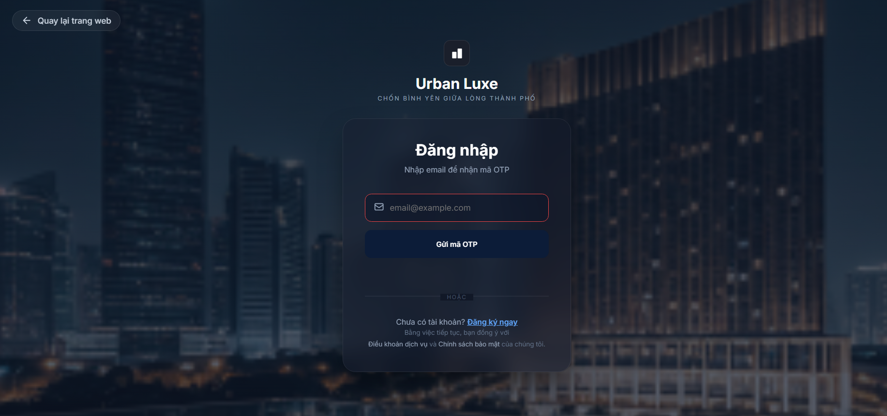
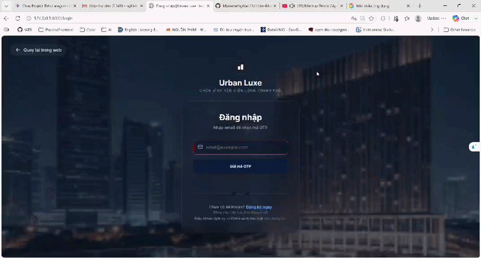
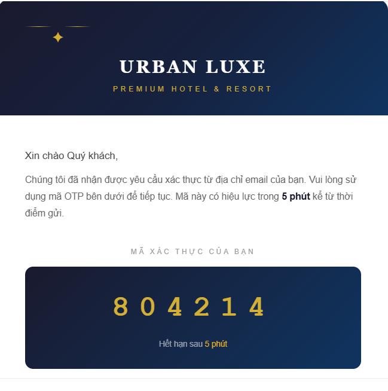
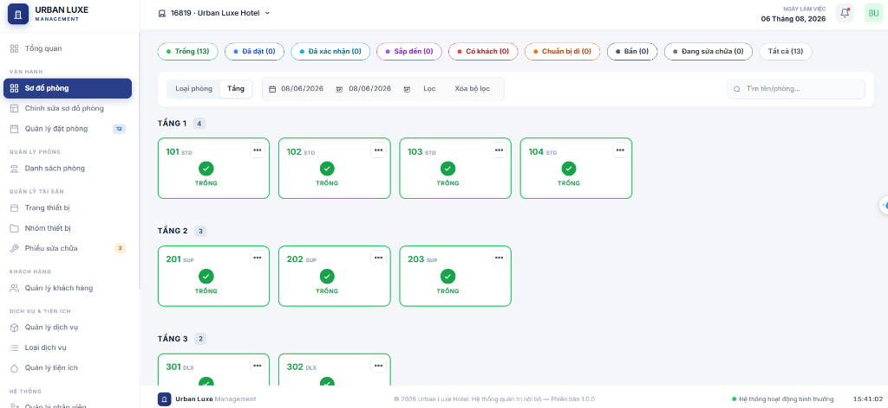
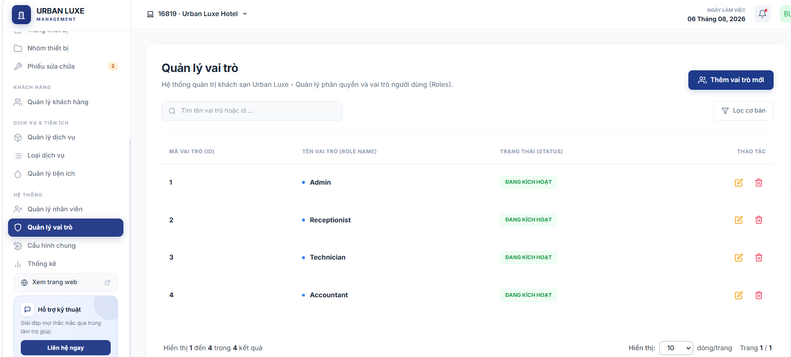
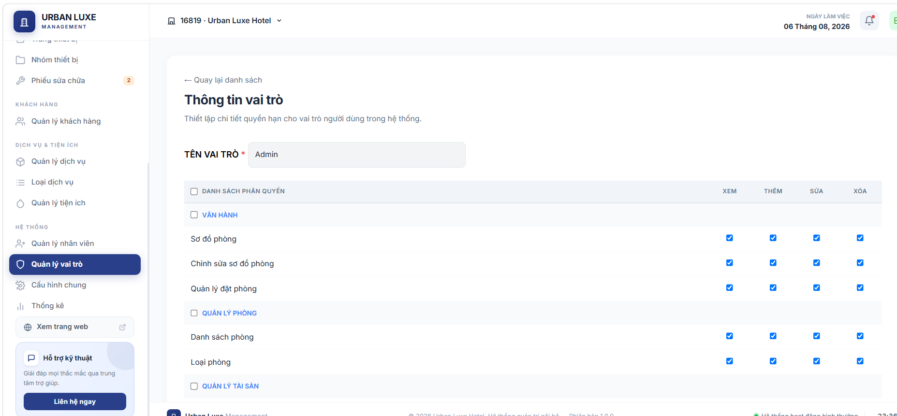

# Hệ thống Quản lý Khách sạn (Hotel Management)

Dự án này là một ứng dụng web toàn diện giúp tự động hóa quy trình đặt phòng, quản lý nhân sự, theo dõi doanh thu và đặc biệt là tích hợp thanh toán trực tuyến qua cổng VNPAY dành cho các khách sạn quy quy mô vừa và nhỏ.

---

## Hình ảnh Demo

### Giao diện Khách hàng (Client)









### Giao diện Quản trị (Admin)






---

## Công nghệ sử dụng

Dự án được xây dựng với kiến trúc hiện đại, phân tách rõ ràng giữa Frontend và Backend.
- **Backend:** Laravel 11 (PHP 8.2)
- **Frontend:** Blade Template, CSS Vanilla, JavaScript, Vite (để build assets)
- **Database:** MySQL
- **Kiến trúc code:** Repository Pattern & Service Pattern (Giúp code dễ bảo trì và mở rộng)
- **Payment Gateway:** VNPAY Sandbox API

---

## Tính năng nổi bật

### Dành cho Khách hàng (Client):
- Tìm kiếm phòng trống theo ngày check-in / check-out.
- Xem thông tin chi tiết các loại phòng (Tiện ích, giá cả, hình ảnh).
- Quy trình đặt phòng (Booking) mượt mà với giỏ hàng.
- **Tích hợp thanh toán VNPAY:** Khách hàng có thể quẹt thẻ ATM hoặc quét mã QR để thanh toán online an toàn. Hệ thống tự động xác thực chữ ký (hash) và cập nhật trạng thái đơn hàng.
- Đăng nhập/Đăng ký tài khoản (hỗ trợ xác thực bằng OTP).
- Tích hợp AI Chatbot hỗ trợ giải đáp thắc mắc tự động.

### Dành cho Quản trị viên (Admin):
- Dashboard thống kê doanh thu và lượt đặt phòng.
- Quản lý Sơ đồ phòng (Room Map): Check-in, Check-out, dọn phòng trực quan.
- Quản lý Nhân viên & Phân quyền (Roles & Permissions).
- Quản lý Hóa đơn và theo dõi trạng thái thanh toán.

---

## Hướng dẫn Cài đặt & Chạy dự án (Local)

Làm theo các bước sau để chạy dự án trên máy tính cá nhân của bạn (khuyên dùng **Laragon** hoặc XAMPP).

**Bước 1: Clone dự án và di chuyển vào thư mục**
```bash
git clone https://github.com/your-username/hotel-management.git
cd hotel-management
```

**Bước 2: Cài đặt thư viện**
```bash
composer install
npm install
```

**Bước 3: Cấu hình môi trường (.env)**
Copy file `.env.example` thành `.env`
```bash
cp .env.example .env
```
Mở file `.env` và cập nhật thông tin Database + VNPAY:
```env
DB_CONNECTION=mysql
DB_HOST=127.0.0.1
DB_PORT=3306
DB_DATABASE=ten_database_cua_ban
DB_USERNAME=root
DB_PASSWORD=

# VNPAY CONFIGURATION (BẮT BUỘC ĐỂ TEST THANH TOÁN)
VNP_TMN_CODE=Mã_Website_Sandbox_Của_Bạn
VNP_HASH_SECRET=Chuỗi_Bí_Mật_Của_Bạn
VNP_URL=https://sandbox.vnpayment.vn/paymentv2/vpcpay.html
VNP_RETURN_URL=http://127.0.0.1:8000/vnpay-return
```

**Bước 4: Khởi tạo dữ liệu & Chạy Server**
```bash
php artisan key:generate
php artisan migrate --seed
php artisan serve
```

Mở thêm 1 terminal thứ 2 để chạy frontend:
```bash
npm run dev
```

Mở thêm 1 terminal thứ 3 để chạy hàng đợi (Queue xử lý gửi Email, v.v.):
```bash
php artisan queue:work
```

---

## Những gì tôi học được từ dự án này?

Qua quá trình thực hiện đồ án này, tôi đã đúc kết được những kinh nghiệm thực chiến quý giá:
1. **Kiến trúc Repository - Service Pattern:** Không viết toàn bộ logic vào Controller, mà tách biệt tầng xử lý dữ liệu (Repository) và tầng nghiệp vụ (Service). Điều này giúp code gọn gàng và dễ dàng tái sử dụng.
2. **Tích hợp API Thanh toán (VNPAY):** Hiểu rõ quy trình bắt tay (handshake) giữa Server của mình và Server thanh toán. Nắm vững cách băm chữ ký điện tử (Hash HMAC SHA512) để bảo mật chống giả mạo giao dịch.
3. **Quản lý Transaction (Database):** Xử lý luồng đặt phòng và tạo hóa đơn phức tạp, đảm bảo tính toàn vẹn dữ liệu (Nếu lỗi ở một bước thì `DB::rollBack()` toàn bộ).
4. **Bảo mật cơ bản:** Phòng chống XSS, SQL Injection và xử lý phân quyền chặt chẽ giữa các loại tài khoản (Admin, Lễ tân, Khách hàng).
